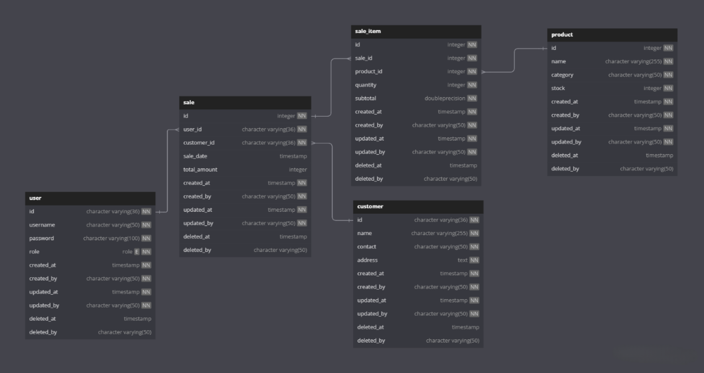
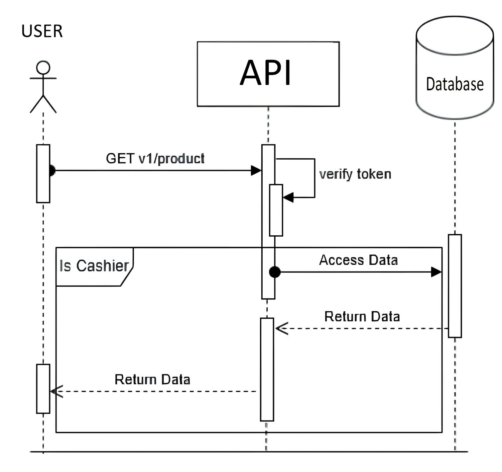

# Jonathan Kevin Giustino 

# Test API Kasir

API untuk sistem POS yang mungurus inventori produk dan sales  

## Contents

- [Design](#GambarDesain)
- [Setup and Installation](#setup-and-installation)
- [Swagger Documentation](#swagger-documentation)
- [API Endpoints](#api-endpoints)


## GambarDesain





Desain diatas merupakan skema untuk sistem Kasir Point of Sale (POS), yang mencakup berbagai entitas, seperti User, Produk, Customer, dan penjualan produk.  Desain ini menyediakan struktur  untuk menyimpan dan mengelola informasi terkait entitas ini dan interaksinya.

1. **Tabel User**:

   - Tabel ini berisi data user pengguna sistem, seperti kasir dan admin 
   - Informasi yang disimpan meliputi ID pengguna, nama pengguna, kata sandi (terenkripsi), peran (admin atau kasir), dan detail audit (created_at, created_by, updated_at, updated_by). 

2. **Tabel Customer**:

   - Tabel ini menyimpan data pelanggan, termasuk nama, informasi kontak, dan alamat mereka. Selain itu, tabel ini juga menyimpan informasi audit.

3. **Tabel Sale**:

   - Tabel ini mencatat transaksi penjualan yang dilakukan oleh pelanggan.
   - Tabel diisi dengan sale ID, user ID (Data Kasir saat itu), customer ID (Data pelanggan yang berbelanja), sale date, total amount, and audit information.
   - 'user_id' dan 'customer_id' adalah foreign keys tabel user dan customer.

4. **Table Sale_Item**:

   - Tabel ini melacak item individual yang terjual dalam tiap sale.
   - Tabel ini berisi sale item ID, sale ID (foreign key referencing the 'sale' table), product_ID, quantity, subtotal, and audit information.

5. **Tabel Product**:

   - Tabel ini berisi produk yang tersedia dalam inventori.
   - Berisi product ID, name, category, stock quantity, and audit information.
   - 'stock' digunakan untuk mengurus ketersediaan produk.

6. **Relationships**:
   - 'user_id' dalam tabel 'sale'  merefer 'id' dalam tabel 'user' , menyambungkan tiap transaksi ke user yang spesifik.
   - 'customer_id' dalam tabel 'sale'  merefer 'id' dalam tabel 'customer' , menyambungkan tiap sale dengan  customer specifik.
   - 'sale_id' dalam tabel 'sale_item'  merefer 'id' dalam tabel 'sale' , Mengasosiasi sale_item dengan sale spesifik.
   - 'product_id' dalam tabel 'sale_item'  merefer 'id' dalam tabel 'product' , menunjukan produk mana yang terjual.

Desain diatas mengandung informasi tentang pengguna, pelanggan, produk, dan penjualan terstruktur secara logis dan dapat diambil serta dikelola secara efisien. Sistem ini memungkinkan pelacakan penjualan, pengelolaan stok, dan penyediaan insight dari data penjualan dan pelanggan


## Setup and Installation

1. Clone the repository and navigate to the root folder

2. Create a `.env` file and set your PostgreSQL DB configurations. Refer to `./infras/postgresql.go` for the required parameters

3. Set up the database tables by running the SQL scripts located in the `./migrations` folder in sequence

4. Generate the necessary wire code:

   ```
   go generate ./...
   ```

5. To start the application, run the following command in the project root folder:

   ```
   go run .
   ```

6. The API will be accessible at [http://localhost:8080](http://localhost:8080)

## Swagger Documentation

To access the API documentation using Swagger, follow these steps:

1. Make sure the server is running locally
2. Open your web browser and go to [http://localhost:8080/swagger/doc.json/](http://localhost:8080/swagger/doc.json/)
3. You'll see the Swagger UI interface with a list of endpoints, request parameters, and example requests/responses
4. You can interact with the API directly from the Swagger interface
5. You can also use Postman Collection provided `mkp-pos-api.postman_collection.json` to interact with the endpoint

## API Endpoints

Endpoint:

### Register Cashier

- **Endpoint:** `POST /v1/cashier/register`
- **Description:** Register an user with cashier role.
- **Request Body Parameters:** `username`, `password`

### Login Cashier

- **Endpoint:** `POST /v1/cashier/login`
- **Description:** Cashier login to access protected endpoints
- **Request Body Parameters:** `username`, `password`

### Read All Product

- **Endpoint:** `GET /v1/products`
- **Description:** View all product
- **Authentication:** Requires authentication and cashier role.
- **Query Parameters:** `page` (default: 1), `pageSize` (default: 10)

### Insert a New Product

- **Endpoint:** `POST /v1/products`
- **Description:** Insert a new product.
- **Authentication:** Requires authentication and cashier role.
- **Request Body Parameters:** `name`, `category`, and `stock`


